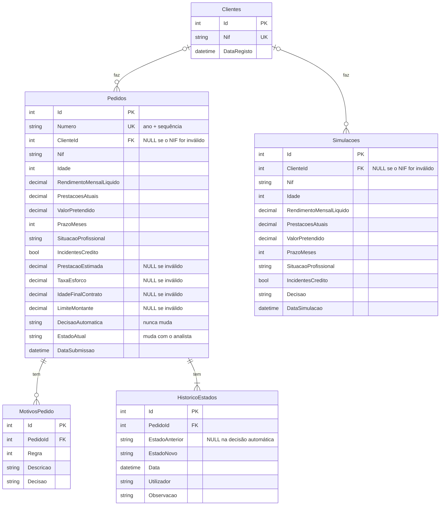

# Tarefa 1 - Análise Funcional

> Antes de desenvolver a solução, responda às seguintes questões.

As respostas são curtas; as decisões e os pormenores de cada uma estão no
[DECISIONS.md](../DECISIONS.md).

---

## 1. Como interpreto as regras de negócio

A aplicação faz uma **pré-análise**: não aprova créditos sozinha em todos os casos, separa os pedidos
que podem avançar, os que têm de ser recusados e os que precisam de um analista.

- **Regra 1, validação inicial:** antes de analisar, os dados têm de fazer sentido (NIF com 9
  dígitos, pelo menos 18 anos, rendimento, valor e prazo acima de zero). Se não fizerem, o pedido é
  inválido e não se analisa mais nada. Mostram-se todos os erros de uma vez.
- **Regra 2, idade no fim do contrato:** se o cliente tiver mais de 75 anos quando acabar de pagar,
  o pedido vai a um analista.
- **Regra 3, incidentes de crédito:** quem tem incidentes registados é recusado.
- **Regra 4, situação profissional:** efetivo prossegue; contrato a prazo vai a um analista;
  desempregado é recusado.
- **Regra 5, limite do montante:** pedir mais de 20 vezes o rendimento mensal vai a um analista.
- **Regra 6, taxa de esforço:** a parte do rendimento que fica comprometida com prestações (as que
  já existem mais a nova). Até 35% não muda nada; acima de 35% e até 50% vai a um analista; acima
  de 50% é recusado.
- **Regra 7, montantes elevados:** acima de 50.000 € vai sempre, no mínimo, a um analista.
- **Regra 8, prioridade:** várias regras podem aplicar-se ao mesmo pedido; ganha a mais restritiva
  (inválido, depois recusado, depois análise manual, depois aprovado). Sem nenhuma regra contra, o
  pedido é aprovado.

## 2. Ordem pela qual aplico as regras

1. **Regra 1 primeiro.** Com dados inválidos (por exemplo, prazo zero) não é possível calcular os
   indicadores, por isso a análise pára aqui.
2. **Calcular os indicadores:** prestação nova, taxa de esforço, idade no fim do contrato e montante
   máximo.
3. **Regras 2 a 7, todas**, mesmo que uma já tenha recusado. Assim o resultado mostra todos os
   motivos, e o cliente ou o analista percebe tudo o que está em causa, e não só o primeiro problema.
4. **Regra 8 no fim**, para escolher a decisão mais restritiva entre todos os motivos.

Como as regras 2 a 7 são todas avaliadas e a Regra 8 escolhe no fim, a ordem entre elas não muda a
decisão; segui a do enunciado.

## 3. Situações não previstas ou ambíguas

| Situação | O que decidi |
|---|---|
| Prestações atuais negativas | Pedido inválido. |
| Situação profissional em falta | Pedido inválido. |
| O enunciado só pede 9 dígitos no NIF | Validei só os 9 dígitos (sem o dígito de controlo) e guardei o NIF como texto, para não perder zeros à esquerda. Espaços, pontos e hífenes são aceites e retirados ("123 456 789"). |
| Valores exatamente nos limites (75 anos, 20×, 35%, 50%, 50.000 €) | Li as palavras do enunciado: "superior a" e "exceder" são estritamente maior; "até 35%" e "até 50%" incluem o limite. |
| Arredondamentos | A prestação e a taxa são arredondadas a 2 casas antes de comparar, para o valor mostrado ser o que decide. |
| Idade no fim do contrato | Idade atual + prazo em anos, com a fração (70 anos + 61 meses = 75,08, que passa os 75). |
| "Independentemente das restantes regras" (Regra 7) | Um mínimo: vai pelo menos a análise manual, mas uma recusa de outra regra mantém-se. |
| Prestação sem juros | Como o enunciado manda simplificar. |
| O rendimento é "do agregado", mas a idade e a situação profissional são "do cliente" | Tratei o pedido como tendo um só titular. |
| Limites máximos (idade, prazo, valor) | O enunciado não os define; não acrescentei limites próprios. |
| Pedidos repetidos (o mesmo cliente submete o mesmo pedido duas vezes) | Ficam dois pedidos. |
| Simulações (Tarefa 4 fala em "pedido/simulação") | Ficam registadas numa tabela própria, separadas dos pedidos. |
| "Terminado com o estado X" (Tarefa 4) | É o estado atual do pedido, incluindo as decisões dos analistas. |

## 4. Perguntas que faria ao analista de negócio

1. Deve validar-se o dígito de controlo do NIF?
2. Nos limites, "até 35%" inclui os 35,00%? E exatamente 75 anos no fim do contrato passa?
3. A idade no fim do contrato conta em anos completos ou com a fração do último ano?
4. Na Regra 7, "independentemente das restantes regras" quer dizer "no mínimo análise manual" ou
   "sempre análise manual, mesmo que outra regra recuse"?
5. O rendimento é do agregado: pode haver mais do que um titular? Nesse caso, as regras de idade e
   de situação profissional aplicam-se a quem?
6. Há outras situações profissionais (reformado, independente, estudante)? Como se tratam?
7. Há limites máximos de idade atual, prazo ou montante?
8. Em produção, que taxa de juro e que fórmula de prestação usar?
9. Quem pode decidir os pedidos em análise manual, e a decisão tem de ser justificada?
10. As simulações devem ficar registadas? Durante quanto tempo?
11. Um cliente com um pedido em análise pode submeter outro?

## 5. Proposta de solução em user stories

**Épico:** pré-análise automática de pedidos de crédito pessoal, com decisão, motivos e
indicadores, e análise manual dos casos que as regras não resolvem.

### US1. Submeter um pedido e ver a decisão

**Como** cliente (ou gestor de balcão), **quero** submeter um pedido de crédito e ver logo a
decisão, os motivos e os indicadores, **para** saber se posso avançar e porquê.

Critérios de aceitação:

- **Dado** o cenário A do enunciado, **quando** submeto, **então** a decisão é APROVADO, sem
  motivos, com prestação de 166,67 € e taxa de esforço de 14,67%.
- **Dado** o cenário B, **quando** submeto, **então** a decisão é ANÁLISE MANUAL, com os motivos
  "contrato a prazo" e "taxa de esforço entre 35% e 50%".
- **Dado** o cenário C, **então** RECUSADO por incidentes de crédito; **dado** o cenário D,
  **então** RECUSADO pela taxa de esforço, com o motivo do montante acima do limite também visível.
- **Dado** um pedido com vários dados inválidos, **quando** submeto, **então** a decisão é PEDIDO
  INVÁLIDO e vejo todos os erros de uma vez.
- **Dado** um NIF escrito com espaços ("123 456 789"), **quando** submeto, **então** é aceite e
  gravado sem os espaços.
- **Quando** submeto, **então** o pedido fica gravado com um número (ano + sequência, por exemplo
  20260001).

### US2. Simular sem submeter

**Como** cliente, **quero** simular um pedido sem o submeter, **para** experimentar valores e prazos
antes de decidir.

Critérios de aceitação:

- **Quando** simulo, **então** vejo o mesmo resultado que veria ao submeter.
- **Quando** simulo, **então** não é criado nenhum pedido, mas a simulação fica registada para
  estatística.

### US3. Decidir os pedidos em análise manual

**Como** analista de crédito, **quero** ver os pedidos em análise manual e aprová-los ou recusá-los
com uma justificação, **para** decidir os casos que as regras automáticas não resolvem.

Critérios de aceitação:

- **Dado** um pedido em ANÁLISE MANUAL, **quando** o aprovo ou recuso com o meu nome e uma
  observação, **então** o estado passa a APROVADO ou RECUSADO e a decisão fica no histórico.
- **Dado** que não escrevo o nome ou a observação, **então** a decisão não é aceite.
- **Dado** um pedido que não está em análise manual, **então** não o consigo decidir.
- **Quando** decido, **então** a decisão automática original não muda.

### US4. Consultar os pedidos

**Como** analista, **quero** uma lista dos pedidos, filtrável por estado, e o detalhe de cada um,
**para** encontrar os que esperam por mim e perceber cada decisão.

Critérios de aceitação:

- A lista mostra os pedidos do mais recente para o mais antigo, 20 por página, com filtro por estado.
- O detalhe mostra os dados, a análise automática, o estado atual e o histórico de estados.

### US5. Ajustar os limites das regras

**Como** responsável de risco, **quero** alterar os limites das regras (idade, múltiplo do
rendimento, taxas de esforço, montante elevado) sem alterar o programa, **para** adaptar a política
de crédito.

Critérios de aceitação:

- **Dado** um limite alterado na configuração, **então** os novos pedidos são analisados com o novo
  limite.
- Sem configuração, aplicam-se os valores do enunciado.

### US6. Extrair informação para reporting

**Como** analista de reporting, **quero** extrair da base de dados as aprovações, as recusas e os
seus motivos, os clientes com vários pedidos ou simulações e os pedidos que passaram de análise
manual a aprovado, **para** acompanhar a atividade de crédito.

Critérios de aceitação: as cinco consultas da Tarefa 4, em
[sql/Tarefa4_Consultas.sql](../sql/Tarefa4_Consultas.sql).

## 6. Modelo de dados

- **`DecisaoAutomatica` e `EstadoAtual` separados:** a decisão do motor nunca muda; o estado atual
  muda quando um analista decide, e cada mudança fica em `HistoricoEstados`.
- **Os motivos numa tabela própria**, uma linha por regra que disparou, para se poder contar o
  motivo de recusa mais frequente.
- **Os pedidos inválidos também são gravados**, para auditoria. Sem NIF válido, ficam sem cliente.
- **As simulações separadas dos pedidos**, porque não têm número, estado nem histórico.

Os porquês de cada escolha estão na secção [Base de dados](../DECISIONS.md#base-de-dados) do
DECISIONS.md.
